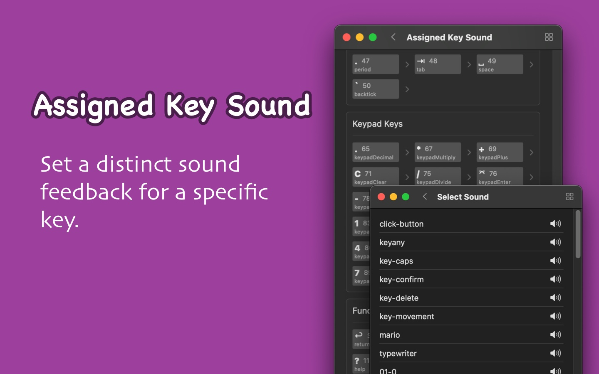
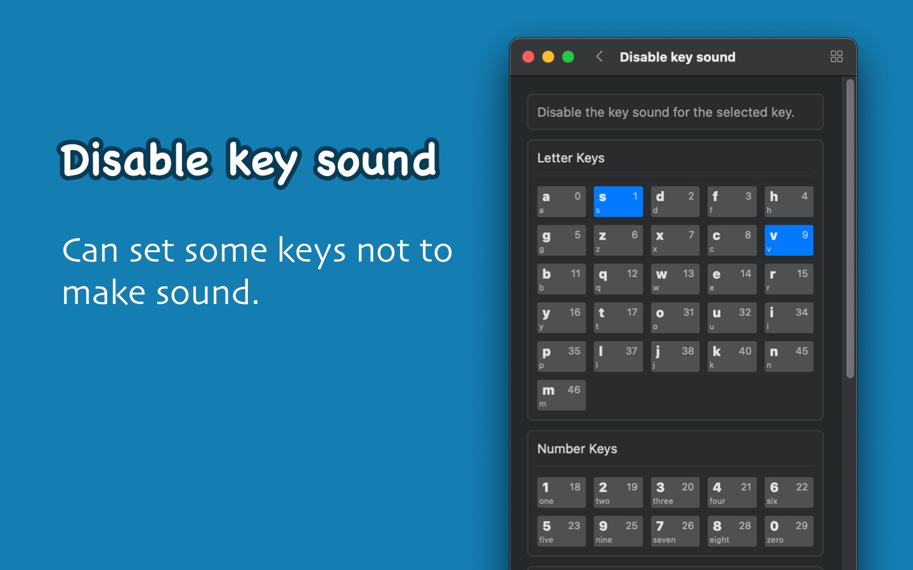

<!--idoc:ignore:start-->
> [!TIP]
> Declaration: This project is not an open-source project. The repository serves as the official website, used to collect issues and user demands. This is done to save costs, because without an official website, the application cannot pass the review.
<!--idoc:ignore:end-->

   
   
  
  <h1>
    KeyClicker
  </h1>
  <!--rehype:style=border: 0;-->
  

    <a href="./README.zh.md">简体中文</a> • 
		<a href="#frequently-asked-questions">FAQ</a> • 
    <a href="./feedback.md">Contact & Support</a> • 
    <a href="https://github.com/jaywcjlove/key-clicker/releases">Changelog</a>
  

  

    
    
  

Minimum requirement: `macOS 14.0`; download from GitHub for the latest version.

KeyClicker is an app that brings users a true keyboard typing sound experience, recreating the typing feel of mechanical keyboards and typewriters.

If you are a writer or have a fondness for the sound of typewriters, KeyClicker will be your ideal choice. Many writers believe that the sound of a typewriter helps them focus more and inspires their creativity. While the charm of a physical typewriter is unique, it lacks the convenient features of modern devices, such as efficient editing and digital operations. With KeyClicker, you can enjoy the classic sound of a typewriter while retaining the powerful editing and publishing capabilities of macOS devices.

If you are a programmer, KeyClicker can also bring you the ultimate experience of typing on a mechanical keyboard, making every keystroke immersive, enhancing your focus and enjoyment while coding!

## Frequently Asked Questions

### System Sound Overlap Issue

If you hear two key sounds after setting the key sound, it may be because the system's default sound overlaps with the custom key sound. To solve this problem, you can go to `System Settings` -> `Sound` and turn off the two options: `Play user interface sound effects` and `Play feedback when volume is changed`, to avoid interference between the system sound and the custom sound.

