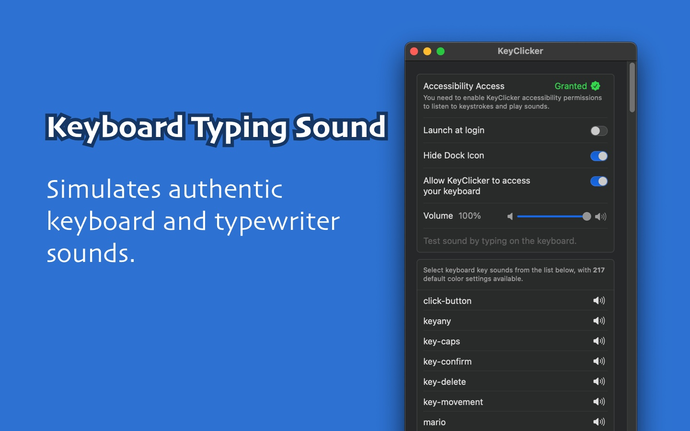
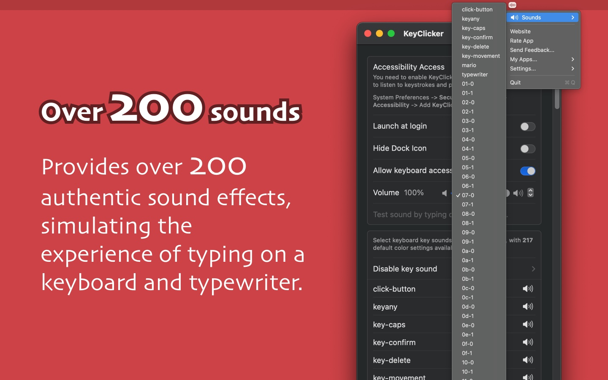

   
   
  
  <h1>
    KeyClicker
  </h1>
  <!--rehype:style=border: 0;-->
  

    <a href="./README.zh.md">简体中文</a> • 
    <a href="https://github.com/jaywcjlove/key-clicker/releases">变更日志</a>
  

  

    
  

KeyClicker 是一款在 macOS 上为用户带来真实键盘打字声音体验的应用，完美再现机械键盘与打字机的打字感受。

如果你是一名作家，或者对打字机的声音情有独钟，KeyClicker 将是你的理想选择。许多作家认为，打字机的声音能让他们更专注、更有创作灵感。虽然实体打字机的魅力独特，但它缺乏现代设备的便捷功能，例如高效的编辑与数字化操作。而使用 KeyClicker，你既能享受打字机的经典声音，又能保留 macOS 设备强大的编辑和发布功能。

如果你是一名程序员，KeyClicker 同样能为你带来机械键盘打字的极致体验，让每一次敲击都充满沉浸感，提升编程的专注度与乐趣！

<!--version: v1.0.0-->