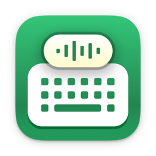

   
   
  
  <h1>
    KeyClicker
  </h1>
  <!--rehype:style=border: 0;-->
  

    <a href="./README.zh.md">简体中文</a> • 
		<a href="#常见问题解答">常见问题</a> • 
    <a href="https://github.com/jaywcjlove/key-clicker/issues/new?assignees=jaywcjlove&labels=support%2Cfeedback%2Cquestion&projects=&template=bug_report_cn.yml&title=%F0%9F%99%8B%E2%80%8D%E2%99%82%EF%B8%8F+%E6%94%AF%E6%8C%81%E4%B8%8E%E5%8F%8D%E9%A6%88%3A+KeyClicker">联系&支持</a> • 
    <a href="https://github.com/jaywcjlove/key-clicker/releases">变更日志</a>
  

  

    
    
  

KeyClicker 为用户带来真实键盘打字声音体验的应用，再现机械键盘与打字机的打字感受。

如果你是一名作家，或者对打字机的声音情有独钟，KeyClicker 将是你的理想选择。许多作家认为，打字机的声音能让他们更专注、更有创作灵感。虽然实体打字机的魅力独特，但它缺乏现代设备的便捷功能，例如高效的编辑与数字化操作。而使用 KeyClicker，你既能享受打字机的经典声音，又能保留 macOS 设备强大的编辑和发布功能。

如果你是一名程序员，KeyClicker 同样能为你带来机械键盘打字的极致体验，让每一次敲击都充满沉浸感，提升编程的专注度与乐趣！

## 常见问题解答

### 系统声音重叠问题

如果您在设置按键声音后听到两个按键音，可能是因为系统默认的声音与自定义按键声音重叠。为了解决这个问题，您可以在 `系统设置` -> `声音` 中关闭 `播放用户界面音效` 和 `音量调整时播放反馈音效` 这两个选项，从而避免系统声音与自定义声音干扰。

<!--version: v1.0.0 -->