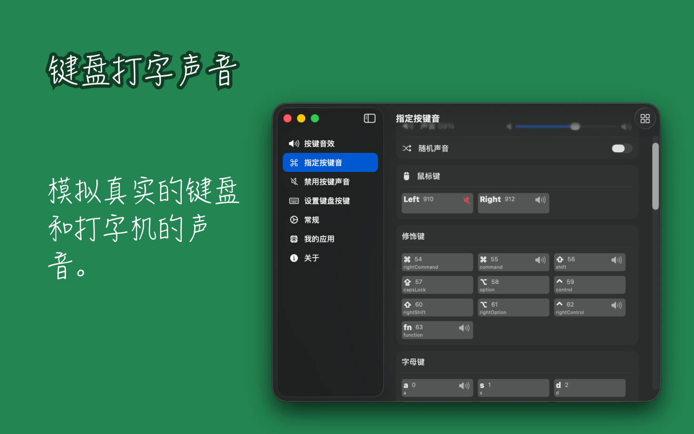
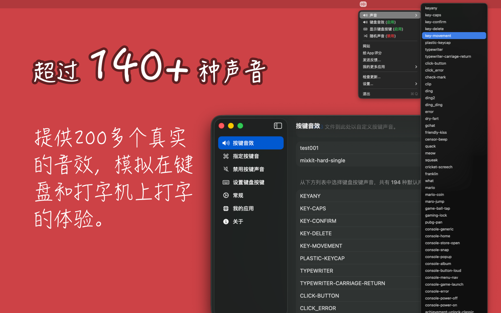

<!--idoc:ignore:start-->
> [!TIP]
> 声明：此项目并非开源项目，仓库作为官方网站，用于收集问题和用户需求。这样做是为了节省成本，因为没有官网，应用无法通过审核。
<!--idoc:ignore:end-->

   
   
  
  <h1>
    KeyClicker
  </h1>
  <!--rehype:style=border: 0;-->
  

    <a href="./README.zh.md">简体中文</a> • 
		<a href="#常见问题解答">常见问题</a> • 
    <a target="_blank" href="https://github.com/jaywcjlove/key-clicker/issues/new?template=bug_report_cn.yml">联系&支持</a> • 
    <a href="./CHANGELOG.zh.md">更新日志</a>
  

  

    
  

最低操作系统要求：`macOS 14.0`；通过 GitHub 下载以优先体验最新版本

KeyClicker 为用户带来真实的键盘打字声音体验，再现机械键盘与打字机的敲击感受，并支持在桌面上显示按下的快捷键，适用于会议、教学或视频教程制作等场合。

对于作家或打字机爱好者，KeyClicker 是理想的选择。许多作家发现，打字机的声音能帮助他们提高专注力和创作灵感。虽然实体打字机有其独特魅力，但它缺乏现代设备的便捷功能，例如高效的编辑和数字化操作。使用 KeyClicker，您既能享受打字机的经典声音，又能保留 macOS 强大的编辑和发布功能。

作为程序员，KeyClicker 也能为您带来极致的机械键盘打字体验，让每一次敲击都充满沉浸感，提升编程的专注度与乐趣！

## 常见问题解答

### 系统声音重叠问题

如果您在设置按键声音后听到两个按键音，可能是因为系统默认的声音与自定义按键声音重叠。为了解决这个问题，您可以在 `系统设置` -> `声音` 中关闭 `播放用户界面音效` 和 `音量调整时播放反馈音效` 这两个选项，从而避免系统声音与自定义声音干扰。

<!--version: v1.0.0 -->